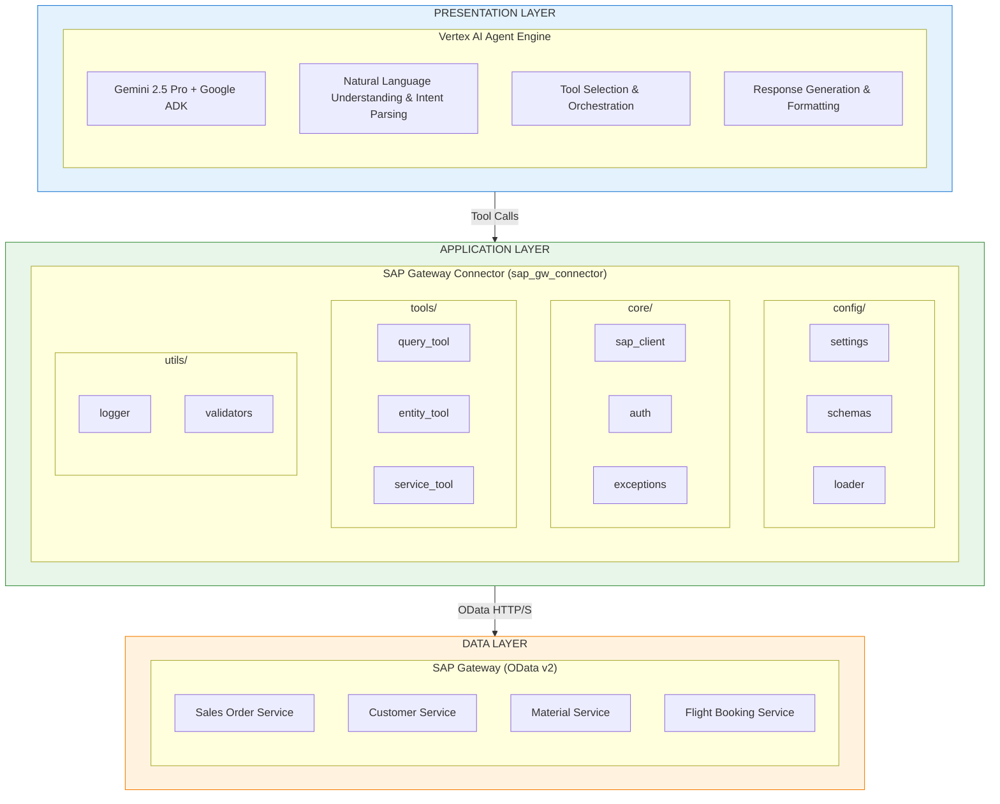
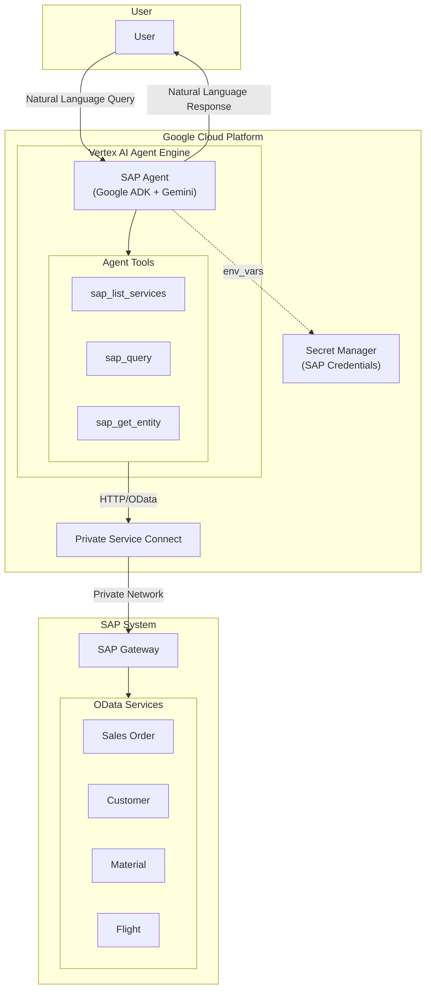
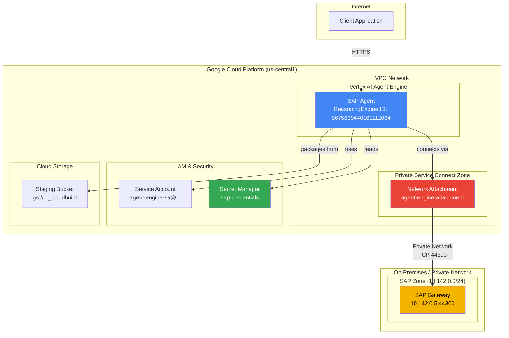
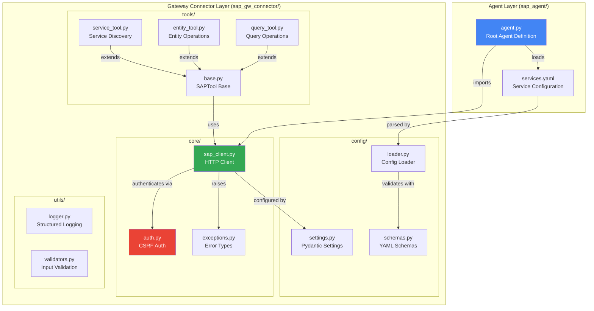
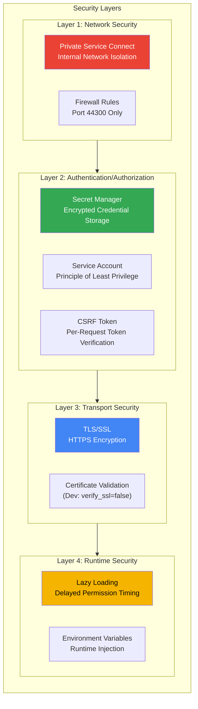
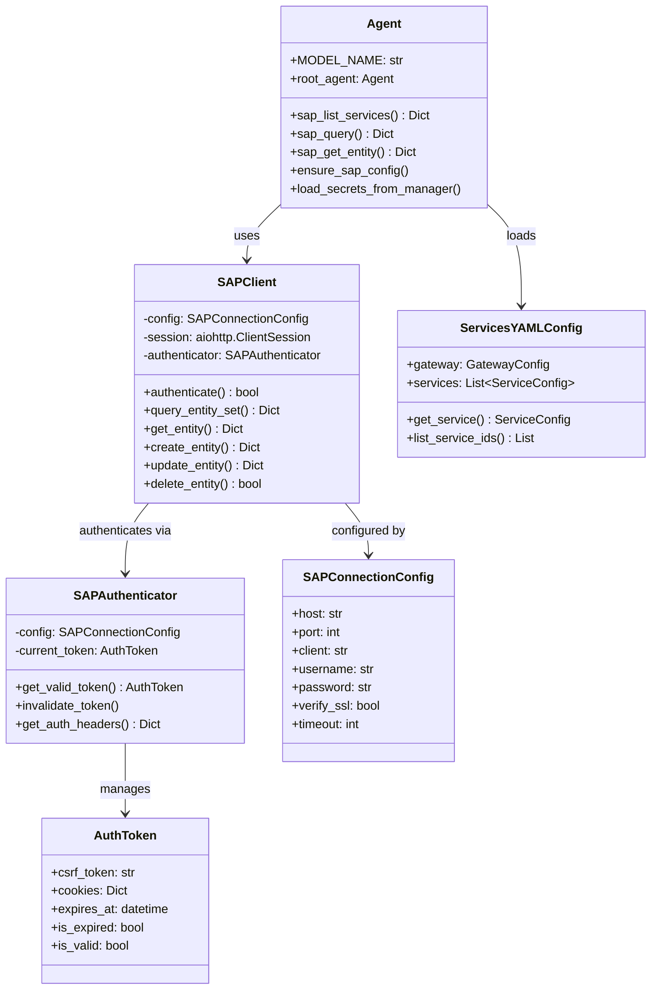
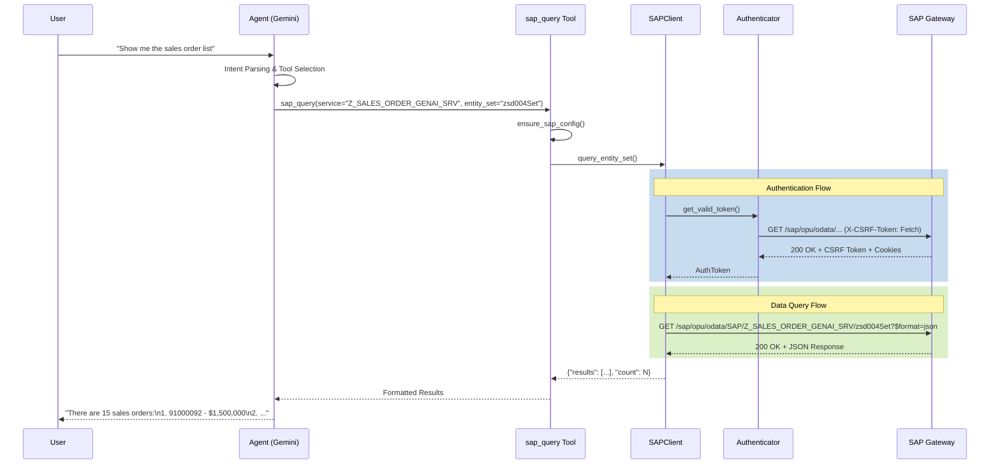
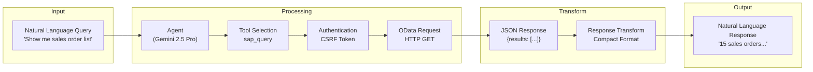
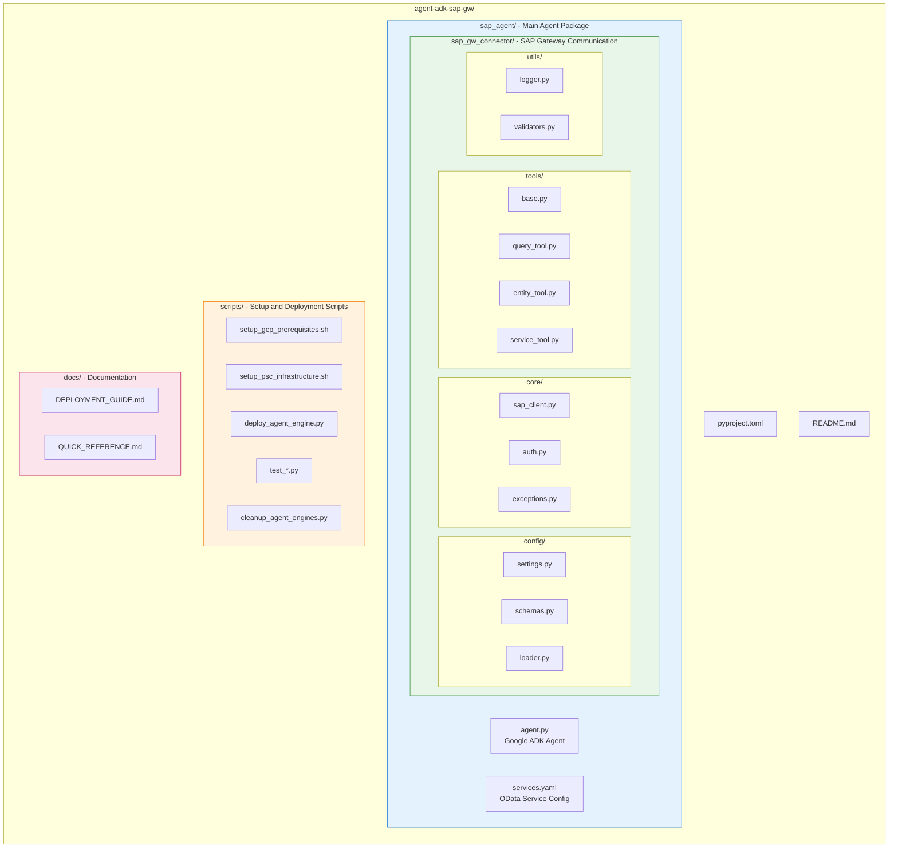

# SAP Agent with Google ADK

An AI Agent integrated with SAP Gateway OData services, enabling natural language queries and analysis of SAP data.

[](https://www.python.org/)
[](https://cloud.google.com/vertex-ai/docs/reasoning-engine/overview)
[](https://cloud.google.com/vertex-ai)

---

## Table of Contents

- [Overview](#overview)
- [Architecture](#architecture)
- [Project Structure](#project-structure)
- [Getting Started](#getting-started)
- [Usage](#usage)
- [Deployment](#deployment)
- [Development Guide](#development-guide)
- [License](#license)

---

## Overview

### Project Purpose

Deploy an AI Agent integrated with SAP OData services to Google Cloud's Vertex AI Agent Engine, providing a system to query and analyze SAP data using natural language.

### Key Features

| Feature | Description |
|---------|-------------|
| `sap_list_services` | List available SAP OData services |
| `sap_query` | Execute filtered queries on SAP entity sets |
| `sap_get_entity` | Retrieve a single entity by specific key |

### Technology Stack

| Component | Technology |
|-----------|------------|
| AI Framework | Google ADK (Agent Development Kit) |
| LLM Model | Gemini 2.5 Pro |
| Deployment Platform | Vertex AI Agent Engine |
| SAP Integration | OData v2 Protocol |
| Credential Management | Google Secret Manager |
| Network | Private Service Connect (PSC) |
| HTTP Client | aiohttp (async) |
| Configuration | Pydantic Settings |

---

## Architecture

### Architecture Overview

This project is designed based on a **3-Tier Architecture**:



### Core Design Principles

| Principle | Description |
|-----------|-------------|
| **Separation of Concerns** | Responsibility separation between Agent, Connector, and SAP layers |
| **Async-First** | Performance optimization with aiohttp-based async HTTP client |
| **Configuration-Driven** | YAML-based service configuration for extension without code changes |
| **Security by Default** | CSRF token, SSL, and Secret Manager integration |
| **Lazy Loading** | Lazy loading pattern to prevent runtime permission issues |

---

### System Architecture



---

### Deployment Architecture



---

### Module Architecture



---

### Security Architecture



#### Security Components

| Component | Description | Implementation Location |
|-----------|-------------|------------------------|
| **Secret Manager** | Encrypted storage of SAP credentials | `agent.py:load_secrets_from_manager()` |
| **CSRF Token** | SAP request integrity verification | `core/auth.py:SAPAuthenticator` |
| **Private Service Connect** | VPC internal network communication | Deployment config `psc_interface_config` |
| **Service Account** | Minimum privilege IAM roles | `agent-engine-sa@...` |
| **Lazy Loading** | Prevent import-time permission issues | `agent.py:_get_secret_manager()` |

### Component Diagram



### SAP Query Sequence Diagram



### Data Flow



---

## Project Structure



### Directory Structure Details

| Directory | Description |
|-----------|-------------|
| `sap_agent/` | Main agent package (Google ADK Agent definition) |
| `sap_agent/sap_gw_connector/` | SAP Gateway communication module |
| `sap_agent/sap_gw_connector/config/` | Pydantic settings and YAML schemas |
| `sap_agent/sap_gw_connector/core/` | SAP HTTP client and authentication |
| `sap_agent/sap_gw_connector/tools/` | SAP tool classes (Query, Entity, Service) |
| `sap_agent/sap_gw_connector/utils/` | Logging and utilities |
| `scripts/` | GCP setup, PSC infrastructure, deployment scripts |
| `docs/` | Deployment guide and reference documentation |

### Key File Descriptions

| File | Description |
|------|-------------|
| `sap_agent/agent.py` | Google ADK Agent definition with 3 SAP tool functions |
| `sap_agent/services.yaml` | SAP OData service and entity configuration |
| `sap_agent/sap_gw_connector/core/sap_client.py` | aiohttp-based async SAP HTTP client |
| `sap_agent/sap_gw_connector/core/auth.py` | CSRF token-based SAP authentication |
| `scripts/setup_gcp_prerequisites.sh` | GCP API, service account, IAM setup script |
| `scripts/setup_psc_infrastructure.sh` | PSC network infrastructure setup script |
| `sap_agent/sap_gw_connector/config/settings.py` | Pydantic-based environment configuration |
| `scripts/deploy_agent_engine.py` | Vertex AI Agent Engine deployment script |

---

## Getting Started

### Requirements

- Python 3.11 or higher
- Google Cloud SDK (gcloud CLI)
- SAP Gateway access credentials
- GCP Project (Owner or Editor permissions)

### Installation

```bash
# Clone the repository
git clone <repository-url>
cd agent-adk-sap-gw

# Create and activate virtual environment
python -m venv .venv
source .venv/bin/activate  # Windows: .venv\Scripts\activate

# Install dependencies
pip install -e ".[dev]"
```

---

## GCP Prerequisites

### Automated Setup (Recommended)

Use scripts to automatically configure all GCP resources:

```bash
# 1. GCP base resource setup (API, service account, IAM)
./scripts/setup_gcp_prerequisites.sh

# 2. PSC network infrastructure setup
./scripts/setup_psc_infrastructure.sh

# 3. Agent deployment
python scripts/deploy_agent_engine.py
```

### Manual Setup

#### Step 1: Enable APIs

```bash
# Set project
export PROJECT_ID="your-project-id"
gcloud config set project $PROJECT_ID

# Enable required APIs
gcloud services enable \
    compute.googleapis.com \
    aiplatform.googleapis.com \
    secretmanager.googleapis.com \
    cloudbuild.googleapis.com \
    storage.googleapis.com \
    iam.googleapis.com \
    iamcredentials.googleapis.com \
    dns.googleapis.com \
    servicenetworking.googleapis.com
```

#### Step 2: Create Service Account

```bash
# Create Agent Engine service account
gcloud iam service-accounts create agent-engine-sa \
    --display-name="SAP Agent Engine Service Account" \
    --description="Service account for SAP Agent deployed on Vertex AI Agent Engine"
```

#### Step 3: Configure IAM Permissions

```bash
PROJECT_ID="your-project-id"
PROJECT_NUMBER=$(gcloud projects describe $PROJECT_ID --format='value(projectNumber)')

# Grant roles to Agent Engine service account
SA_EMAIL="agent-engine-sa@${PROJECT_ID}.iam.gserviceaccount.com"

gcloud projects add-iam-policy-binding $PROJECT_ID \
    --member="serviceAccount:$SA_EMAIL" \
    --role="roles/aiplatform.user"

gcloud projects add-iam-policy-binding $PROJECT_ID \
    --member="serviceAccount:$SA_EMAIL" \
    --role="roles/secretmanager.secretAccessor"

gcloud projects add-iam-policy-binding $PROJECT_ID \
    --member="serviceAccount:$SA_EMAIL" \
    --role="roles/storage.objectViewer"

gcloud projects add-iam-policy-binding $PROJECT_ID \
    --member="serviceAccount:$SA_EMAIL" \
    --role="roles/logging.logWriter"

gcloud projects add-iam-policy-binding $PROJECT_ID \
    --member="serviceAccount:$SA_EMAIL" \
    --role="roles/serviceusage.serviceUsageConsumer"

# Grant permissions to GCP managed service agents
for SA in \
    "service-${PROJECT_NUMBER}@gcp-sa-aiplatform.iam.gserviceaccount.com" \
    "service-${PROJECT_NUMBER}@gcp-sa-aiplatform-re.iam.gserviceaccount.com" \
    "service-${PROJECT_NUMBER}@gcp-sa-aiplatform-cc.iam.gserviceaccount.com"
do
    gcloud projects add-iam-policy-binding $PROJECT_ID \
        --member="serviceAccount:$SA" \
        --role="roles/serviceusage.serviceUsageConsumer"
done

# Network Admin permissions for PSC
gcloud projects add-iam-policy-binding $PROJECT_ID \
    --member="serviceAccount:service-${PROJECT_NUMBER}@gcp-sa-aiplatform.iam.gserviceaccount.com" \
    --role="roles/compute.networkAdmin"

gcloud projects add-iam-policy-binding $PROJECT_ID \
    --member="serviceAccount:service-${PROJECT_NUMBER}@gcp-sa-aiplatform.iam.gserviceaccount.com" \
    --role="roles/dns.peer"
```

### Required APIs

| API | Purpose |
|-----|---------|
| `compute.googleapis.com` | VPC, PSC network management |
| `aiplatform.googleapis.com` | Vertex AI Agent Engine |
| `secretmanager.googleapis.com` | SAP credential storage |
| `cloudbuild.googleapis.com` | Agent packaging and deployment |
| `storage.googleapis.com` | Staging bucket |
| `iam.googleapis.com` | IAM management |
| `dns.googleapis.com` | PSC DNS configuration |
| `servicenetworking.googleapis.com` | Service networking |

### Service Accounts and IAM Roles

| Service Account | Role | Purpose |
|----------------|------|---------|
| `agent-engine-sa` | `roles/aiplatform.user` | Vertex AI usage |
| `agent-engine-sa` | `roles/secretmanager.secretAccessor` | Secret Manager access |
| `agent-engine-sa` | `roles/storage.objectViewer` | Staging bucket read |
| `agent-engine-sa` | `roles/logging.logWriter` | Cloud Logging write |
| `agent-engine-sa` | `roles/serviceusage.serviceUsageConsumer` | Project service usage |
| `gcp-sa-aiplatform` | `roles/compute.networkAdmin` | PSC network management |
| `gcp-sa-aiplatform` | `roles/dns.peer` | PSC DNS peering |
| `gcp-sa-aiplatform-re` | `roles/serviceusage.serviceUsageConsumer` | Reasoning Engine service |
| `gcp-sa-aiplatform-cc` | `roles/serviceusage.serviceUsageConsumer` | Code Container service |

---

## Environment Configuration

### Local Development Environment

Create `.env` file for SAP credentials:

```bash
# sap_agent/.env
SAP_HOST=your-sap-host.com
SAP_PORT=44300
SAP_CLIENT=100
SAP_USERNAME=your_username
SAP_PASSWORD=your_password
```

### Google Cloud Authentication

```bash
# GCP authentication
gcloud auth application-default login

# Set project
gcloud config set project YOUR_PROJECT_ID
```

### Secret Manager Setup (For Deployment)

```bash
# Create secret
gcloud secrets create sap-credentials --replication-policy="automatic"

# Set secret value
echo '{
  "host": "10.142.0.5",
  "port": 44300,
  "client": "100",
  "username": "YOUR_USERNAME",
  "password": "YOUR_PASSWORD"
}' | gcloud secrets versions add sap-credentials --data-file=-
```

---

## Usage

### SAP Service Configuration

Configure SAP OData services in `sap_agent/services.yaml`:

```yaml
gateway:
  base_url_pattern: "https://{host}:{port}/sap/opu/odata"
  auth_endpoint:
    use_catalog_metadata: true

services:
  - id: Z_SALES_ORDER_GENAI_SRV
    name: "Sales Order GenAI Service"
    path: "/SAP/Z_SALES_ORDER_GENAI_SRV"
    version: v2
    entities:
      - name: zsd004Set
        key_field: Vbeln
        description: "Sales orders entity set"
```

### Local Testing

```python
from sap_agent.agent import root_agent, sap_list_services, sap_query

# List services
services = sap_list_services()
print(services)

# Query data
result = sap_query(
    service="Z_SALES_ORDER_GENAI_SRV",
    entity_set="zsd004Set",
    top=10
)
print(result)
```

### Agent Engine Usage

```python
from vertexai import agent_engines

# Load deployed Agent
agent = agent_engines.get("projects/PROJECT_NUMBER/locations/REGION/reasoningEngines/AGENT_ID")

# Create session and query
session = agent.create_session()
response = session.send_message("Show me the last 10 sales orders from SAP")
print(response.text)
```

---

## Deployment

### Vertex AI Agent Engine Deployment

```bash
# Run deployment script
python scripts/deploy_agent_engine.py
```

The deployment script performs the following:
1. Load SAP credentials from Secret Manager
2. Wrap Agent as AdkApp
3. Deploy to Agent Engine with PSC network configuration

### Deployment Configuration

| Item | Value |
|------|-------|
| Region | us-central1 |
| Model | gemini-2.5-pro |
| Network | PSC (Private Service Connect) |
| Service Account | agent-engine-sa@PROJECT.iam.gserviceaccount.com |

### Verify Deployment

```bash
# Check Agent Engine list
gcloud ai reasoning-engines list --region=us-central1
```

For detailed deployment guide, see [docs/DEPLOYMENT_GUIDE.md](docs/DEPLOYMENT_GUIDE.md).

---

## Development Guide

### Code Style

```bash
# Run Ruff lint
ruff check .

# Type check
mypy sap_agent

# Spell check
codespell
```

### Testing

```bash
# Run tests
pytest

# With coverage
pytest --cov=sap_agent
```

### Adding New SAP Services

1. Add service definition to `services.yaml`
2. Verify service activation in SAP transaction `/IWFND/MAINT_SERVICE`
3. Test locally then deploy

---

## Troubleshooting

### Common Issues

| Issue | Solution |
|-------|----------|
| Gateway subprocess not available | Switched to Direct Python functions |
| serviceUsageConsumer permission error | Grant role to service account |
| Secret Manager import error | Lazy loading pattern applied |
| Event loop conflict | Use `nest_asyncio` package |
| SAP connection timeout | Verify internal IP (when using PSC) |

For detailed troubleshooting, see [docs/DEPLOYMENT_GUIDE.md](docs/DEPLOYMENT_GUIDE.md).

---

## License

MIT License

---

## References

- [Google ADK Documentation](https://cloud.google.com/vertex-ai/docs/reasoning-engine/overview)
- [Vertex AI Agent Engine](https://cloud.google.com/vertex-ai/docs/reasoning-engine/deploy)
- [SAP OData Services](https://help.sap.com/docs/SAP_NETWEAVER_AS_ABAP_751_IP)

---

## Documentation

- [Korean Documentation (한국어 문서)](docs/KR/README.md)
