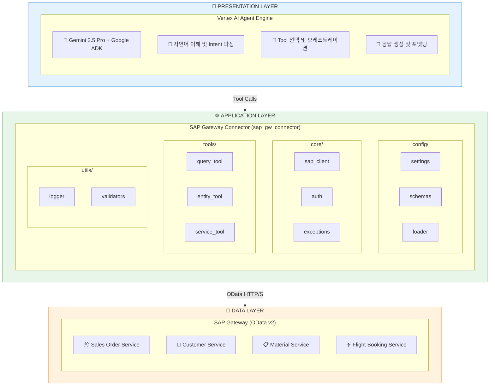
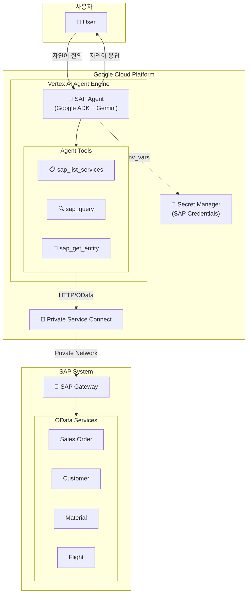
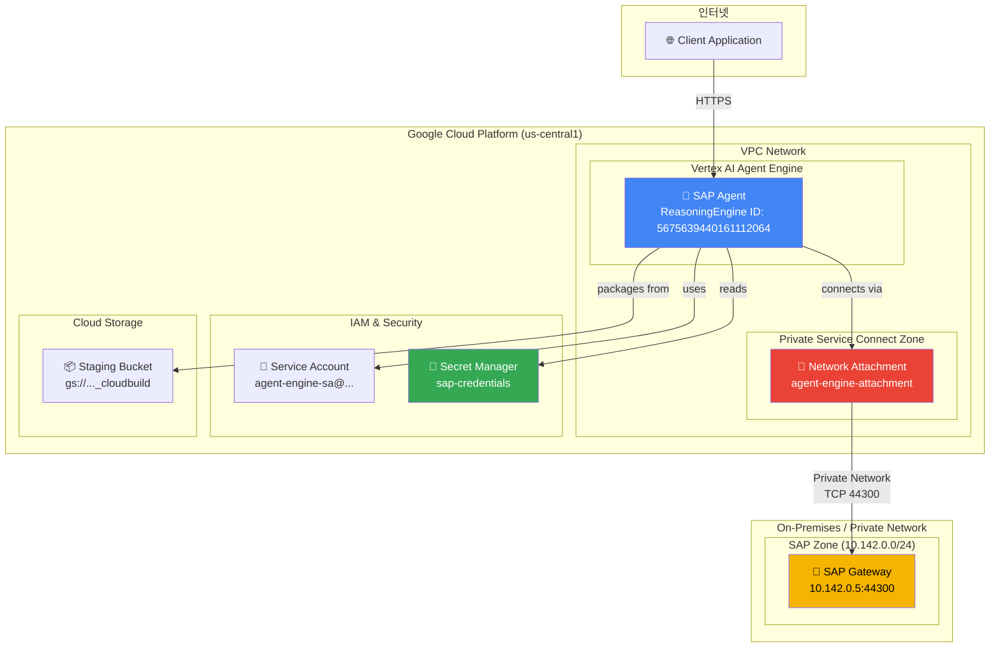
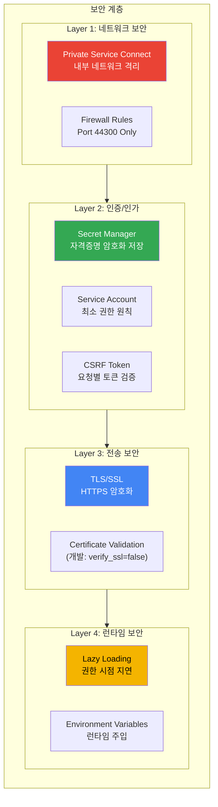
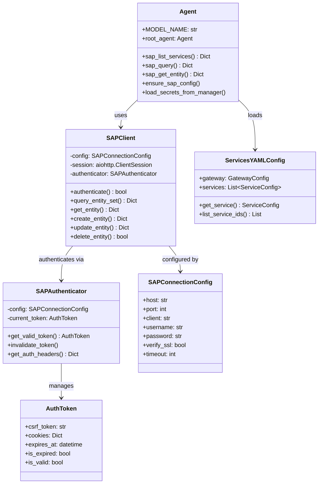
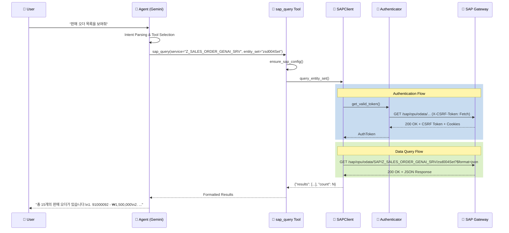
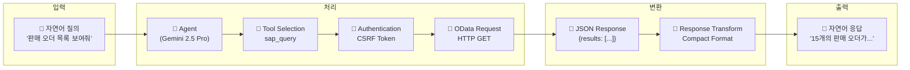
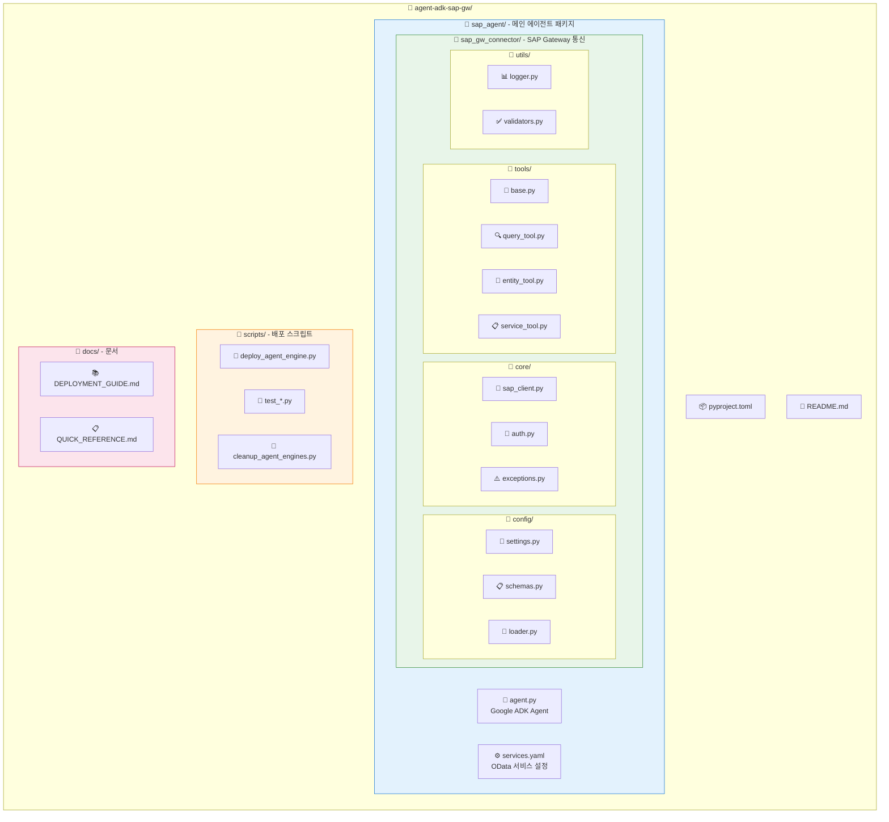

# SAP Agent with Google ADK

SAP Gateway OData 서비스와 통합된 AI Agent로, 자연어를 통해 SAP 데이터를 조회하고 분석할 수 있습니다.

[](https://www.python.org/)
[](https://cloud.google.com/vertex-ai/docs/reasoning-engine/overview)
[](https://cloud.google.com/vertex-ai)

---

## 목차

- [개요](#개요)
- [아키텍처](#아키텍처)
- [프로젝트 구조](#프로젝트-구조)
- [시작하기](#시작하기)
- [사용법](#사용법)
- [배포](#배포)
- [개발 가이드](#개발-가이드)
- [라이선스](#라이선스)

---

## 개요

### 프로젝트 목적

SAP OData 서비스와 통합된 AI Agent를 Google Cloud의 Vertex AI Agent Engine에 배포하여, 자연어로 SAP 데이터를 조회하고 분석할 수 있는 시스템을 제공합니다.

### 주요 기능

| 기능 | 설명 |
|------|------|
| `sap_list_services` | 사용 가능한 SAP OData 서비스 목록 조회 |
| `sap_query` | SAP 엔티티 세트에 대한 필터링 쿼리 실행 |
| `sap_get_entity` | 특정 키로 단일 엔티티 조회 |

### 기술 스택

| 구성요소 | 기술 |
|---------|------|
| AI Framework | Google ADK (Agent Development Kit) |
| LLM Model | Gemini 2.5 Pro |
| 배포 플랫폼 | Vertex AI Agent Engine |
| SAP 연동 | OData v2 Protocol |
| 인증 관리 | Google Secret Manager |
| 네트워크 | Private Service Connect (PSC) |
| HTTP Client | aiohttp (async) |
| 설정 관리 | Pydantic Settings |

---

## 아키텍처

### 아키텍처 개요

이 프로젝트는 **3-Tier 아키텍처**를 기반으로 설계되었습니다:



### 핵심 설계 원칙

| 원칙 | 설명 |
|------|------|
| **Separation of Concerns** | Agent, Connector, SAP 각 계층의 책임 분리 |
| **Async-First** | aiohttp 기반 비동기 HTTP 클라이언트로 성능 최적화 |
| **Configuration-Driven** | YAML 기반 서비스 설정으로 코드 변경 없이 확장 가능 |
| **Security by Default** | CSRF 토큰, SSL, Secret Manager 통합 |
| **Lazy Loading** | 런타임 권한 이슈 방지를 위한 지연 로딩 패턴 |

---

### 시스템 아키텍처



---

### 배포 아키텍처



---

### 모듈 아키텍처


---

### 보안 아키텍처



#### 보안 구성 요소

| 구성 요소 | 설명 | 구현 위치 |
|----------|------|----------|
| **Secret Manager** | SAP 자격증명 암호화 저장 | `agent.py:load_secrets_from_manager()` |
| **CSRF Token** | SAP 요청 무결성 검증 | `core/auth.py:SAPAuthenticator` |
| **Private Service Connect** | VPC 내부 네트워크 통신 | 배포 설정 `psc_interface_config` |
| **Service Account** | 최소 권한 IAM 역할 | `agent-engine-sa@...` |
| **Lazy Loading** | Import 시점 권한 이슈 방지 | `agent.py:_get_secret_manager()` |

### 컴포넌트 다이어그램



### SAP 쿼리 시퀀스 다이어그램



### 데이터 플로우



---

## 프로젝트 구조



### 디렉토리 구조 상세

| 디렉토리 | 설명 |
|----------|------|
| `sap_agent/` | 메인 에이전트 패키지 (Google ADK Agent 정의) |
| `sap_agent/sap_gw_connector/` | SAP Gateway 통신 모듈 |
| `sap_agent/sap_gw_connector/config/` | Pydantic 설정 및 YAML 스키마 |
| `sap_agent/sap_gw_connector/core/` | SAP HTTP 클라이언트 및 인증 |
| `sap_agent/sap_gw_connector/tools/` | SAP 도구 클래스 (Query, Entity, Service) |
| `sap_agent/sap_gw_connector/utils/` | 로깅 및 유틸리티 |
| `scripts/` | 배포 및 테스트 스크립트 |
| `docs/` | 배포 가이드 및 참조 문서 |

### 주요 파일 설명

| 파일 | 설명 |
|------|------|
| `sap_agent/agent.py` | Google ADK Agent 정의, 3개의 SAP 도구 함수 포함 |
| `sap_agent/services.yaml` | SAP OData 서비스 및 엔티티 설정 |
| `sap_agent/sap_gw_connector/core/sap_client.py` | aiohttp 기반 비동기 SAP HTTP 클라이언트 |
| `sap_agent/sap_gw_connector/core/auth.py` | CSRF 토큰 기반 SAP 인증 처리 |
| `sap_agent/sap_gw_connector/config/settings.py` | Pydantic 기반 환경 설정 관리 |
| `scripts/deploy_agent_engine.py` | Vertex AI Agent Engine 배포 스크립트 |

---

## 시작하기

### 요구사항

- Python 3.11 이상
- Google Cloud SDK
- SAP Gateway 접근 권한
- GCP 프로젝트 (Vertex AI, Secret Manager 활성화)

### 설치

```bash
# 저장소 클론
git clone <repository-url>
cd agent-adk-sap-gw

# 가상환경 생성 및 활성화
python -m venv .venv
source .venv/bin/activate  # Windows: .venv\Scripts\activate

# 의존성 설치
pip install -e ".[dev]"
```

### 환경 설정

#### 1. SAP 자격증명 설정

로컬 개발용 `.env` 파일 생성:

```bash
# sap_agent/.env
SAP_HOST=your-sap-host.com
SAP_PORT=44300
SAP_CLIENT=100
SAP_USERNAME=your_username
SAP_PASSWORD=your_password
```

#### 2. Google Cloud 인증

```bash
# GCP 인증
gcloud auth application-default login

# 프로젝트 설정
gcloud config set project YOUR_PROJECT_ID
```

#### 3. Secret Manager 설정 (배포용)

```bash
# Secret 생성
gcloud secrets create sap-credentials --replication-policy="automatic"

# Secret 값 설정
echo '{
  "host": "10.142.0.5",
  "port": 44300,
  "client": "100",
  "username": "YOUR_USERNAME",
  "password": "YOUR_PASSWORD"
}' | gcloud secrets versions add sap-credentials --data-file=-
```

---

## 사용법

### SAP 서비스 설정

`sap_agent/services.yaml` 파일에서 SAP OData 서비스를 설정합니다:

```yaml
gateway:
  base_url_pattern: "https://{host}:{port}/sap/opu/odata"
  auth_endpoint:
    use_catalog_metadata: true

services:
  - id: Z_SALES_ORDER_GENAI_SRV
    name: "Sales Order GenAI Service"
    path: "/SAP/Z_SALES_ORDER_GENAI_SRV"
    version: v2
    entities:
      - name: zsd004Set
        key_field: Vbeln
        description: "Sales orders entity set"
```

### 로컬 테스트

```python
from sap_agent.agent import root_agent, sap_list_services, sap_query

# 서비스 목록 조회
services = sap_list_services()
print(services)

# 데이터 쿼리
result = sap_query(
    service="Z_SALES_ORDER_GENAI_SRV",
    entity_set="zsd004Set",
    top=10
)
print(result)
```

### Agent Engine 사용

```python
from vertexai import agent_engines

# 배포된 Agent 로드
agent = agent_engines.get("projects/PROJECT_NUMBER/locations/REGION/reasoningEngines/AGENT_ID")

# 세션 생성 및 쿼리
session = agent.create_session()
response = session.send_message("SAP에서 최근 판매 오더 10개를 보여줘")
print(response.text)
```

---

## 배포

### Vertex AI Agent Engine 배포

```bash
# 배포 스크립트 실행
python scripts/deploy_agent_engine.py
```

배포 스크립트는 다음을 수행합니다:
1. Secret Manager에서 SAP 자격증명 로드
2. Agent를 AdkApp으로 래핑
3. PSC 네트워크 설정과 함께 Agent Engine에 배포

### 배포 설정

| 항목 | 값 |
|------|-----|
| Region | us-central1 |
| Model | gemini-2.5-pro |
| Network | PSC (Private Service Connect) |
| Service Account | agent-engine-sa@PROJECT.iam.gserviceaccount.com |

### 배포 확인

```bash
# Agent Engine 목록 확인
gcloud ai reasoning-engines list --region=us-central1
```

자세한 배포 가이드는 [docs/DEPLOYMENT_GUIDE.md](docs/DEPLOYMENT_GUIDE.md)를 참조하세요.

---

## 개발 가이드

### 코드 스타일

```bash
# Ruff 린트 실행
ruff check .

# 타입 체크
mypy sap_agent

# 스펠 체크
codespell
```

### 테스트

```bash
# 테스트 실행
pytest

# 커버리지 포함
pytest --cov=sap_agent
```

### 새 SAP 서비스 추가

1. `services.yaml`에 서비스 정의 추가
2. SAP 트랜잭션 `/IWFND/MAINT_SERVICE`에서 서비스 활성화 확인
3. 로컬에서 테스트 후 배포

---

## 트러블슈팅

### 일반적인 이슈

| 이슈 | 해결 방법 |
|------|----------|
| Gateway subprocess 불가 | Direct Python 함수로 전환됨 |
| serviceUsageConsumer 권한 오류 | 서비스 계정에 역할 부여 |
| Secret Manager import 오류 | Lazy loading 패턴 적용됨 |
| Event loop 충돌 | `nest_asyncio` 패키지 사용 |
| SAP 연결 타임아웃 | 내부 IP 확인 (PSC 사용 시) |

자세한 트러블슈팅은 [docs/DEPLOYMENT_GUIDE.md](docs/DEPLOYMENT_GUIDE.md)를 참조하세요.

---

## 라이선스

MIT License

---

## 참고 문서

- [Google ADK Documentation](https://cloud.google.com/vertex-ai/docs/reasoning-engine/overview)
- [Vertex AI Agent Engine](https://cloud.google.com/vertex-ai/docs/reasoning-engine/deploy)
- [SAP OData Services](https://help.sap.com/docs/SAP_NETWEAVER_AS_ABAP_751_IP)
