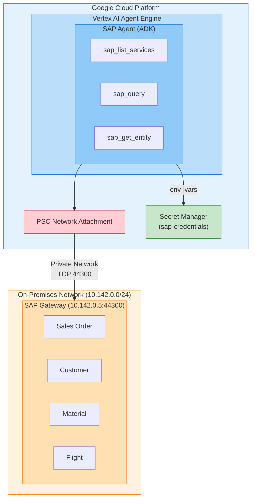

# SAP Agent - Vertex AI Agent Engine Deployment Guide

## Table of Contents

1. [Project Overview](#project-overview)
2. [Architecture](#architecture)
3. [Prerequisites](#prerequisites)
4. [Issues Encountered During Deployment and Solutions](#issues-encountered-during-deployment-and-solutions)
5. [Deployment Method](#deployment-method)
6. [Configuration Details](#configuration-details)
7. [Testing and Verification](#testing-and-verification)
8. [Troubleshooting](#troubleshooting)

---

## Project Overview

### Purpose
Build a system that allows natural language queries and analysis of SAP data by deploying an AI Agent integrated with SAP OData services to Google Cloud's Vertex AI Agent Engine.

### Key Features
- **sap_list_services**: List available SAP OData services
- **sap_query**: Execute filtered queries on SAP entity sets
- **sap_get_entity**: Retrieve a single entity by specific key

### Technology Stack
| Component | Technology |
|-----------|------------|
| AI Framework | Google ADK (Agent Development Kit) |
| LLM Model | Gemini 2.5 Pro |
| Deployment Platform | Vertex AI Agent Engine |
| SAP Integration | OData v2 Protocol |
| Credential Management | Google Secret Manager |
| Network | Private Service Connect (PSC) |

---

## Architecture



### Key Design Decisions

#### 1. Direct Python Functions (Gateway Connector Approach)
- **Reason**: Subprocess execution not available in Agent Engine's serverless environment
- **Solution**: Reimplemented SAP tools as direct Python functions
- **Benefits**: Better error handling, simpler deployment

#### 2. Private Service Connect (PSC)
- **Reason**: SAP server located in internal network
- **Configuration**: `agent-engine-attachment` network connection
- **IP**: Uses internal IP `10.142.0.5` (external IP not accessible)

#### 3. Environment Variable-Based Authentication
- **Reason**: Permission issues may occur when accessing Secret Manager directly
- **Solution**: Pass SAP credentials as `env_vars` during deployment
- **Backup**: Maintain Secret Manager fallback logic

---

## Prerequisites

> **Important**: All IP addresses, project IDs, credentials, and resource names shown in this documentation are **examples only**. You must replace them with values specific to your environment.

### GCP Resources
- Vertex AI API enabled
- Secret Manager API enabled
- Cloud Build API enabled

### Service Accounts and Permissions

```bash
# Required service accounts
1. agent-engine-sa@{PROJECT_ID}.iam.gserviceaccount.com
2. service-{PROJECT_NUMBER}@gcp-sa-aiplatform.iam.gserviceaccount.com
3. service-{PROJECT_NUMBER}@gcp-sa-aiplatform-re.iam.gserviceaccount.com
4. service-{PROJECT_NUMBER}@gcp-sa-aiplatform-cc.iam.gserviceaccount.com

# Required roles
- roles/serviceusage.serviceUsageConsumer
- roles/aiplatform.user
- roles/secretmanager.secretAccessor
```

### Secret Manager Setup

```bash
# Create sap-credentials secret
gcloud secrets create sap-credentials --replication-policy="automatic"

# Set secret value (JSON format)
# ⚠️ EXAMPLE VALUES - Replace with your actual SAP environment settings
echo '{
  "host": "10.142.0.5",
  "port": 44300,
  "client": "100",
  "username": "YOUR_USERNAME",
  "password": "YOUR_PASSWORD"
}' | gcloud secrets versions add sap-credentials --data-file=-
# host: Your SAP Gateway internal IP (e.g., 10.x.x.x for PSC access)
# port: SAP Gateway port (typically 44300 for HTTPS, 8000 for HTTP)
# client: SAP client number (e.g., 100, 200, 800)
# username/password: Your SAP system credentials
```

### Network Setup
- Create VPC Network Attachment: `agent-engine-attachment`
- Configure firewall rules to SAP server (port 44300)

---

## Issues Encountered During Deployment and Solutions

### Issue 1: Subprocess Execution Not Available

**Symptom**:
```
Server subprocess startup failed in Agent Engine environment
```

**Cause**: Subprocess execution is restricted in Agent Engine's serverless environment

**Solution**:
- Reimplemented SAP tools as direct Python functions
- Implemented `sap_list_services`, `sap_query`, `sap_get_entity` functions in `sap_agent/agent.py`

```python
# Before: Subprocess-based
tools = [Toolset(connection_params=...)]

# After: Direct Python functions
tools = [sap_list_services, sap_query, sap_get_entity]
```

---

### Issue 2: serviceUsageConsumer Permission Error

**Symptom**:
```
Error: Caller does not have required permission to use project [your-project-id].
Grant the caller the roles/serviceusage.serviceUsageConsumer role
```

**Cause**: AI Platform service accounts don't have project usage permissions

**Solution**:
```bash
# Grant permissions to all related service accounts
PROJECT_ID="[your-project-id]"
PROJECT_NUMBER="[your-project-number]"

for SA in \
  "service-${PROJECT_NUMBER}@gcp-sa-aiplatform.iam.gserviceaccount.com" \
  "service-${PROJECT_NUMBER}@gcp-sa-aiplatform-re.iam.gserviceaccount.com" \
  "service-${PROJECT_NUMBER}@gcp-sa-aiplatform-cc.iam.gserviceaccount.com" \
  "agent-engine-sa@${PROJECT_ID}.iam.gserviceaccount.com"
do
  gcloud projects add-iam-policy-binding $PROJECT_ID \
    --member="serviceAccount:$SA" \
    --role="roles/serviceusage.serviceUsageConsumer"
done
```

---

### Issue 3: Secret Manager Import-Time Permission Error

**Symptom**:
```
Permission error occurs when accessing Secret Manager at module import time
Failure at Agent Engine initialization stage
```

**Cause**:
- `from google.cloud import secretmanager` executes at module load time
- Permissions are not fully configured during Agent Engine initialization stage

**Solution**: Apply Lazy Loading pattern

```python
# Before: Load at import time
from google.cloud import secretmanager
HAS_SECRET_MANAGER = True

# After: Lazy Loading
HAS_SECRET_MANAGER = False
secretmanager = None

def _get_secret_manager():
    """Lazy load secret manager to avoid import-time permission issues."""
    global secretmanager, HAS_SECRET_MANAGER
    if secretmanager is None:
        try:
            from google.cloud import secretmanager as sm
            secretmanager = sm
            HAS_SECRET_MANAGER = True
        except ImportError:
            HAS_SECRET_MANAGER = False
    return secretmanager
```

Additionally, skip Secret Manager access if environment variables are already set:

```python
# At module initialization
if not os.getenv("SAP_HOST"):
    try:
        load_secrets_from_manager()
    except Exception as e:
        print(f"Note: Could not load from Secret Manager: {e}")
else:
    print(f"SAP credentials already configured via environment variables")
```

---

### Issue 4: Event Loop Conflict

**Symptom**:
```
RuntimeError: This event loop is already running
Occurs when calling asyncio.get_event_loop().run_until_complete()
```

**Cause**: Agent Engine calls synchronous functions within an already running event loop

**Solution**: Add `nest_asyncio` package

```python
# Add at top of sap_agent/agent.py
try:
    import nest_asyncio
    nest_asyncio.apply()
except ImportError:
    pass
```

```python
# Add to requirements in scripts/deploy_agent_engine.py
requirements=[
    ...
    "nest-asyncio>=1.5.0",
]
```

---

### Issue 5: SAP Connection Timeout

**Symptom**:
```
Error: Timeout while getting CSRF token
Cannot connect to SAP server
```

**Cause**:
- External IP (`34.75.92.206`) configured in Secret Manager
- Agent Engine can only access internal network via PSC

**Solution**: Change SAP host IP in Secret Manager to internal IP

```bash
# Update with internal IP
echo '{
  "host": "10.142.0.5",
  "port": 44300,
  "client": "100",
  "username": "SAP_USER",
  "password": "SAP_PASSWORD"
}' | gcloud secrets versions add sap-credentials --data-file=-
```

**IP Configuration Comparison**:
| Environment | IP Address | Purpose |
|-------------|------------|---------|
| Local Development | 34.75.92.206 (External) | Access via internet |
| Agent Engine | 10.142.0.5 (Internal) | Access via PSC |

---

## Deployment Method

### 1. Environment Setup

```bash
# Project configuration
export PROJECT_ID="[your-project-id]"
export REGION="us-central1"
export STAGING_BUCKET="gs://[your-project-id]_cloudbuild"

# Authentication
gcloud auth application-default login
gcloud config set project $PROJECT_ID
```

### 2. Run Deployment Script

```bash
cd /path/to/agent-adk-sap-gw
python scripts/deploy_agent_engine.py
```

### 3. Deployment Script Details (`deploy_agent_engine.py`)

```python
from vertexai import agent_engines
import vertexai

# Initialize Vertex AI
vertexai.init(
    project=PROJECT_ID,
    location=LOCATION,
    staging_bucket=STAGING_BUCKET,
)

# Load SAP credentials from Secret Manager
sap_creds = get_sap_credentials()

# Pass as environment variables
env_vars = {
    "SAP_HOST": sap_creds.get("host", ""),
    "SAP_PORT": str(sap_creds.get("port", "44300")),
    "SAP_CLIENT": sap_creds.get("client", "100"),
    "SAP_USERNAME": sap_creds.get("username", ""),
    "SAP_PASSWORD": sap_creds.get("password", ""),
}

# Wrap with AdkApp
app = agent_engines.AdkApp(
    agent=sap_agent.agent.root_agent,
    enable_tracing=True,
)

# Deploy to Agent Engine
remote_app = agent_engines.create(
    agent_engine=app,
    requirements=[
        "google-cloud-aiplatform[adk,agent_engines]>=1.128.0",
        "google-adk>=1.15.0",
        "google-cloud-secret-manager>=2.16.0",
        "pydantic>=2.5.0",
        "pydantic-settings>=2.1.0",
        "aiohttp>=3.9.0",
        "asyncio-throttle>=1.0.2",
        "structlog>=23.2.0",
        "tenacity>=8.2.3",
        "cryptography>=41.0.7",
        "xmltodict>=0.13.0",
        "pyyaml>=6.0.1",
        "python-dotenv>=1.0.0",
        "nest-asyncio>=1.5.0",
    ],
    extra_packages=["./sap_agent"],
    display_name="SAP Agent",
    service_account=SERVICE_ACCOUNT,
    env_vars=env_vars,
    psc_interface_config={
        "network_attachment": NETWORK_ATTACHMENT,
    }
)
```

---

## Configuration Details

### SAP Service Configuration (`services.yaml`)

```yaml
gateway:
  base_url_pattern: "https://{host}:{port}/sap/opu/odata"
  metadata_suffix: "/$metadata"
  service_catalog_path: "/sap/opu/odata/IWFND/CATALOGSERVICE;v=2/ServiceCollection"
  auth_endpoint:
    use_catalog_metadata: true

services:
  - id: Z_SALES_ORDER_GENAI_SRV
    name: "Sales Order GenAI Service"
    path: "/SAP/Z_SALES_ORDER_GENAI_SRV"
    version: v2
    entities:
      - name: zsd004Set
        key_field: Vbeln
        description: "Sales orders entity set"

  - id: Z_TRAVEL_RECO_SRV
    name: "Flight Recommendation Service"
    path: "/SAP/Z_TRAVEL_RECO_SRV"
    version: v2
    entities:
      - name: FlightSet
        key_field: Connid
      - name: BookingSet
        key_field: Bookid
      # ... additional entities
```

### Agent Configuration (`sap_agent/agent.py`)

```python
MODEL_NAME = "gemini-2.5-pro"  # Or environment variable SAP_AGENT_MODEL

root_agent = Agent(
    model=MODEL_NAME,
    name='sap_agent',
    description='SAP Gateway integration agent for OData queries and operations',
    instruction=AGENT_INSTRUCTION,
    tools=[
        sap_list_services,
        sap_query,
        sap_get_entity,
    ],
)
```

---

## Testing and Verification

### Agent Engine Test

```python
from vertexai import agent_engines

# Load deployed Agent
agent = agent_engines.get("projects/[your-project-number]/locations/[region]/reasoningEngines/[agent-id]")

# Create session and query
session = agent.create_session()
response = session.send_message("Show me the list of available SAP services")
print(response.text)
```

### Expected Result

```
SAP OData Service List:
1. Z_SALES_ORDER_GENAI_SRV - Sales Order GenAI Service
2. Z_CUSTOMER_SRV - Customer Master Data Service
3. Z_MATERIAL_SRV - Material Master Service
4. Z_TRAVEL_RECO_SRV - Flight Recommendation Service
...
```

---

## Troubleshooting

### Problem: SAP Service Not Found

**Symptom**:
```
No service found for namespace '', name 'Z_SALES_ORDER_GENAI_SRV'
```

**Solution**:
1. Verify service activation in SAP transaction `/IWFND/MAINT_SERVICE`
2. Confirm `services.yaml` service path matches actual SAP service
3. Check service namespace (path includes `/SAP/` or other namespace)

### Problem: Authentication Failure

**Symptom**:
```
401 Unauthorized or CSRF token error
```

**Solution**:
1. Verify username/password in Secret Manager
2. Check if SAP user account is locked
3. Verify SAP client number

### Problem: Network Connection Failure

**Symptom**:
```
Connection timeout or Connection refused
```

**Solution**:
1. Confirm SAP host IP is internal IP (`10.x.x.x`)
2. Verify PSC Network Attachment configuration
3. Check firewall rules allow port 44300

---

## Appendix

### Deployed Resource Information

| Item | Value |
|------|-------|
| Project ID | [your-project-id] |
| Project Number | [your-project-number] |
| Region | us-central1 |
| Agent Engine ID | [your-agent-id] |
| Resource Name | projects/[your-project-number]/locations/us-central1/reasoningEngines/[your-agent-id] |
| Service Account | agent-engine-sa@[your-project-id].iam.gserviceaccount.com |
| Network Attachment | agent-engine-attachment |
| SAP Host (Internal) | 10.142.0.5:44300 |

### Reference Documentation

- [Google ADK Documentation](https://cloud.google.com/vertex-ai/docs/reasoning-engine/overview)
- [Vertex AI Agent Engine](https://cloud.google.com/vertex-ai/docs/reasoning-engine/deploy)
- [SAP OData Services](https://help.sap.com/docs/SAP_NETWEAVER_AS_ABAP_751_IP/68bf513362174d54b58cddec28794093/3a5d93e4a1bc10148a29e3e3eb0b219c.html)

---

## Documentation

- [Korean Documentation (한국어 문서)](KR/DEPLOYMENT_GUIDE.md)

---

*Document Date: December 2025*
*Author: Claude Code*
