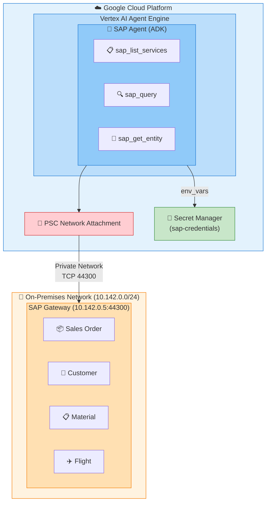

# SAP Agent - Vertex AI Agent Engine 배포 가이드

## 목차

1. [프로젝트 개요](#프로젝트-개요)
2. [아키텍처](#아키텍처)
3. [사전 요구사항](#사전-요구사항)
4. [배포 과정에서 발생한 이슈 및 해결](#배포-과정에서-발생한-이슈-및-해결)
5. [배포 방법](#배포-방법)
6. [설정 상세](#설정-상세)
7. [테스트 및 검증](#테스트-및-검증)
8. [트러블슈팅](#트러블슈팅)

---

## 프로젝트 개요

### 목적
SAP OData 서비스와 통합된 AI Agent를 Google Cloud의 Vertex AI Agent Engine에 배포하여, 자연어로 SAP 데이터를 조회하고 분석할 수 있는 시스템 구축.

### 주요 기능
- **sap_list_services**: 사용 가능한 SAP OData 서비스 목록 조회
- **sap_query**: SAP 엔티티 세트에 대한 필터링 쿼리 실행
- **sap_get_entity**: 특정 키로 단일 엔티티 조회

### 기술 스택
| 구성요소 | 기술 |
|---------|------|
| AI Framework | Google ADK (Agent Development Kit) |
| LLM Model | Gemini 2.5 Pro |
| 배포 플랫폼 | Vertex AI Agent Engine |
| SAP 연동 | OData v2 Protocol |
| 인증 관리 | Google Secret Manager |
| 네트워크 | Private Service Connect (PSC) |

---

## 아키텍처



### 핵심 설계 결정

#### 1. Direct Python Functions (Gateway Connector 방식)
- **이유**: Agent Engine의 서버리스 환경에서 subprocess 실행 불가
- **해결**: SAP 도구를 직접 Python 함수로 재구현
- **장점**: 더 나은 에러 핸들링, 간단한 배포

#### 2. Private Service Connect (PSC)
- **이유**: SAP 서버가 내부 네트워크에 위치
- **구성**: `agent-engine-attachment` 네트워크 연결
- **IP**: 내부 IP `10.142.0.5` 사용 (외부 IP 불가)

#### 3. 환경 변수 기반 인증
- **이유**: Secret Manager 직접 접근 시 권한 문제 발생 가능
- **해결**: 배포 시 `env_vars`로 SAP 자격증명 전달
- **백업**: Secret Manager fallback 로직 유지

---

## 사전 요구사항

### GCP 리소스
- Vertex AI API 활성화
- Secret Manager API 활성화
- Cloud Build API 활성화

### 서비스 계정 및 권한

```bash
# 필요한 서비스 계정
1. agent-engine-sa@{PROJECT_ID}.iam.gserviceaccount.com
2. service-{PROJECT_NUMBER}@gcp-sa-aiplatform.iam.gserviceaccount.com
3. service-{PROJECT_NUMBER}@gcp-sa-aiplatform-re.iam.gserviceaccount.com
4. service-{PROJECT_NUMBER}@gcp-sa-aiplatform-cc.iam.gserviceaccount.com

# 필요한 역할
- roles/serviceusage.serviceUsageConsumer
- roles/aiplatform.user
- roles/secretmanager.secretAccessor
```

### Secret Manager 설정

```bash
# sap-credentials 시크릿 생성
gcloud secrets create sap-credentials --replication-policy="automatic"

# 시크릿 값 설정 (JSON 형식)
echo '{
  "host": "10.142.0.5",
  "port": 44300,
  "client": "100",
  "username": "YOUR_USERNAME",
  "password": "YOUR_PASSWORD"
}' | gcloud secrets versions add sap-credentials --data-file=-
```

### 네트워크 설정
- VPC Network Attachment 생성: `agent-engine-attachment`
- SAP 서버로의 방화벽 규칙 설정 (포트 44300)

---

## 배포 과정에서 발생한 이슈 및 해결

### 이슈 1: Subprocess 실행 불가

**증상**:
```
Agent Engine 환경에서 서버 subprocess 시작 실패
```

**원인**: Agent Engine의 서버리스 환경에서는 subprocess 실행이 제한됨

**해결**:
- SAP 도구를 직접 Python 함수로 재구현
- `sap_agent/agent.py`에 `sap_list_services`, `sap_query`, `sap_get_entity` 함수 구현

```python
# Before: Subprocess 기반
tools = [Toolset(connection_params=...)]

# After: Direct Python functions
tools = [sap_list_services, sap_query, sap_get_entity]
```

---

### 이슈 2: serviceUsageConsumer 권한 오류

**증상**:
```
Error: Caller does not have required permission to use project [your-project-id].
Grant the caller the roles/serviceusage.serviceUsageConsumer role
```

**원인**: AI Platform 서비스 계정들에 프로젝트 사용 권한 없음

**해결**:
```bash
# 모든 관련 서비스 계정에 권한 부여
PROJECT_ID="[your-project-id]"
PROJECT_NUMBER="[your-project-number]"

for SA in \
  "service-${PROJECT_NUMBER}@gcp-sa-aiplatform.iam.gserviceaccount.com" \
  "service-${PROJECT_NUMBER}@gcp-sa-aiplatform-re.iam.gserviceaccount.com" \
  "service-${PROJECT_NUMBER}@gcp-sa-aiplatform-cc.iam.gserviceaccount.com" \
  "agent-engine-sa@${PROJECT_ID}.iam.gserviceaccount.com"
do
  gcloud projects add-iam-policy-binding $PROJECT_ID \
    --member="serviceAccount:$SA" \
    --role="roles/serviceusage.serviceUsageConsumer"
done
```

---

### 이슈 3: Secret Manager Import 시점 권한 오류

**증상**:
```
모듈 import 시점에 Secret Manager 접근 시도로 인한 권한 오류
Agent Engine 초기화 단계에서 실패
```

**원인**:
- `from google.cloud import secretmanager`가 모듈 로드 시점에 실행
- Agent Engine 초기화 단계에서는 아직 권한이 완전히 설정되지 않음

**해결**: Lazy Loading 패턴 적용

```python
# Before: Import 시점에 로드
from google.cloud import secretmanager
HAS_SECRET_MANAGER = True

# After: Lazy Loading
HAS_SECRET_MANAGER = False
secretmanager = None

def _get_secret_manager():
    """Lazy load secret manager to avoid import-time permission issues."""
    global secretmanager, HAS_SECRET_MANAGER
    if secretmanager is None:
        try:
            from google.cloud import secretmanager as sm
            secretmanager = sm
            HAS_SECRET_MANAGER = True
        except ImportError:
            HAS_SECRET_MANAGER = False
    return secretmanager
```

추가로, 환경 변수가 이미 설정된 경우 Secret Manager 접근 스킵:

```python
# 모듈 초기화 시
if not os.getenv("SAP_HOST"):
    try:
        load_secrets_from_manager()
    except Exception as e:
        print(f"Note: Could not load from Secret Manager: {e}")
else:
    print(f"SAP credentials already configured via environment variables")
```

---

### 이슈 4: Event Loop 충돌

**증상**:
```
RuntimeError: This event loop is already running
asyncio.get_event_loop().run_until_complete() 호출 시 발생
```

**원인**: Agent Engine이 이미 실행 중인 event loop 내에서 동기 함수 호출

**해결**: `nest_asyncio` 패키지 추가

```python
# sap_agent/agent.py 상단에 추가
try:
    import nest_asyncio
    nest_asyncio.apply()
except ImportError:
    pass
```

```python
# scripts/deploy_agent_engine.py requirements에 추가
requirements=[
    ...
    "nest-asyncio>=1.5.0",
]
```

---

### 이슈 5: SAP 연결 타임아웃

**증상**:
```
Error: Timeout while getting CSRF token
SAP 서버에 연결할 수 없음
```

**원인**:
- Secret Manager에 외부 IP (`34.75.92.206`) 설정됨
- Agent Engine은 PSC를 통해 내부 네트워크만 접근 가능

**해결**: Secret Manager의 SAP host IP를 내부 IP로 변경

```bash
# 내부 IP로 업데이트
echo '{
  "host": "10.142.0.5",
  "port": 44300,
  "client": "100",
  "username": "SAP_USER",
  "password": "SAP_PASSWORD"
}' | gcloud secrets versions add sap-credentials --data-file=-
```

**IP 설정 비교**:
| 환경 | IP 주소 | 용도 |
|------|---------|------|
| 로컬 개발 | 34.75.92.206 (외부) | 인터넷 통한 접근 |
| Agent Engine | 10.142.0.5 (내부) | PSC 통한 접근 |

---

## 배포 방법

### 1. 환경 설정

```bash
# 프로젝트 설정
export PROJECT_ID="[your-project-id]"
export REGION="us-central1"
export STAGING_BUCKET="gs://[your-project-id]_cloudbuild"

# 인증
gcloud auth application-default login
gcloud config set project $PROJECT_ID
```

### 2. 배포 스크립트 실행

```bash
cd /path/to/agent-adk-sap-gw
python scripts/deploy_agent_engine.py
```

### 3. 배포 스크립트 상세 (`deploy_agent_engine.py`)

```python
from vertexai import agent_engines
import vertexai

# Vertex AI 초기화
vertexai.init(
    project=PROJECT_ID,
    location=LOCATION,
    staging_bucket=STAGING_BUCKET,
)

# Secret Manager에서 SAP 자격증명 로드
sap_creds = get_sap_credentials()

# 환경 변수로 전달
env_vars = {
    "SAP_HOST": sap_creds.get("host", ""),
    "SAP_PORT": str(sap_creds.get("port", "44300")),
    "SAP_CLIENT": sap_creds.get("client", "100"),
    "SAP_USERNAME": sap_creds.get("username", ""),
    "SAP_PASSWORD": sap_creds.get("password", ""),
}

# AdkApp 래핑
app = agent_engines.AdkApp(
    agent=sap_agent.agent.root_agent,
    enable_tracing=True,
)

# Agent Engine에 배포
remote_app = agent_engines.create(
    agent_engine=app,
    requirements=[
        "google-cloud-aiplatform[adk,agent_engines]>=1.128.0",
        "google-adk>=1.15.0",
        "google-cloud-secret-manager>=2.16.0",
        "pydantic>=2.5.0",
        "pydantic-settings>=2.1.0",
        "aiohttp>=3.9.0",
        "asyncio-throttle>=1.0.2",
        "structlog>=23.2.0",
        "tenacity>=8.2.3",
        "cryptography>=41.0.7",
        "xmltodict>=0.13.0",
        "pyyaml>=6.0.1",
        "python-dotenv>=1.0.0",
        "nest-asyncio>=1.5.0",
    ],
    extra_packages=["./sap_agent"],
    display_name="SAP Agent",
    service_account=SERVICE_ACCOUNT,
    env_vars=env_vars,
    psc_interface_config={
        "network_attachment": NETWORK_ATTACHMENT,
    }
)
```

---

## 설정 상세

### SAP 서비스 설정 (`services.yaml`)

```yaml
gateway:
  base_url_pattern: "https://{host}:{port}/sap/opu/odata"
  metadata_suffix: "/$metadata"
  service_catalog_path: "/sap/opu/odata/IWFND/CATALOGSERVICE;v=2/ServiceCollection"
  auth_endpoint:
    use_catalog_metadata: true

services:
  - id: Z_SALES_ORDER_GENAI_SRV
    name: "Sales Order GenAI Service"
    path: "/SAP/Z_SALES_ORDER_GENAI_SRV"
    version: v2
    entities:
      - name: zsd004Set
        key_field: Vbeln
        description: "Sales orders entity set"

  - id: Z_TRAVEL_RECO_SRV
    name: "Flight Recommendation Service"
    path: "/SAP/Z_TRAVEL_RECO_SRV"
    version: v2
    entities:
      - name: FlightSet
        key_field: Connid
      - name: BookingSet
        key_field: Bookid
      # ... 추가 엔티티
```

### Agent 설정 (`sap_agent/agent.py`)

```python
MODEL_NAME = "gemini-2.5-pro"  # 또는 환경변수 SAP_AGENT_MODEL

root_agent = Agent(
    model=MODEL_NAME,
    name='sap_agent',
    description='SAP Gateway integration agent for OData queries and operations',
    instruction=AGENT_INSTRUCTION,
    tools=[
        sap_list_services,
        sap_query,
        sap_get_entity,
    ],
)
```

---

## 테스트 및 검증

### Agent Engine 테스트

```python
from vertexai import agent_engines

# 배포된 Agent 로드
agent = agent_engines.get("projects/[your-project-number]/locations/[region]/reasoningEngines/[your-agent-id]")

# 세션 생성 및 쿼리
session = agent.create_session()
response = session.send_message("SAP에서 사용 가능한 서비스 목록을 보여줘")
print(response.text)
```

### 예상 결과

```
SAP OData 서비스 목록:
1. Z_SALES_ORDER_GENAI_SRV - Sales Order GenAI Service
2. Z_CUSTOMER_SRV - Customer Master Data Service
3. Z_MATERIAL_SRV - Material Master Service
4. Z_TRAVEL_RECO_SRV - Flight Recommendation Service
...
```

---

## 트러블슈팅

### 문제: SAP 서비스를 찾을 수 없음

**증상**:
```
No service found for namespace '', name 'Z_SALES_ORDER_GENAI_SRV'
```

**해결**:
1. SAP 트랜잭션 `/IWFND/MAINT_SERVICE`에서 서비스 활성화 확인
2. `services.yaml`의 서비스 path가 실제 SAP 서비스와 일치하는지 확인
3. 서비스 네임스페이스 확인 (path에 `/SAP/` 또는 다른 네임스페이스 포함)

### 문제: 인증 실패

**증상**:
```
401 Unauthorized 또는 CSRF token 오류
```

**해결**:
1. Secret Manager의 username/password 확인
2. SAP 사용자 계정 잠금 상태 확인
3. SAP 클라이언트 번호 확인

### 문제: 네트워크 연결 실패

**증상**:
```
Connection timeout 또는 Connection refused
```

**해결**:
1. SAP host IP가 내부 IP인지 확인 (`10.x.x.x`)
2. PSC Network Attachment 설정 확인
3. 방화벽 규칙에서 포트 44300 허용 확인

---

## 부록

### 배포된 리소스 정보

| 항목 | 값 |
|------|-----|
| Project ID | [your-project-id] |
| Project Number | [your-project-number] |
| Region | us-central1 |
| Agent Engine ID | [your-agent-id] |
| Resource Name | projects/[your-project-number]/locations/us-central1/reasoningEngines/[your-agent-id] |
| Service Account | agent-engine-sa@[your-project-id].iam.gserviceaccount.com |
| Network Attachment | agent-engine-attachment |
| SAP Host (Internal) | 10.142.0.5:44300 |

### 참고 문서

- [Google ADK Documentation](https://cloud.google.com/vertex-ai/docs/reasoning-engine/overview)
- [Vertex AI Agent Engine](https://cloud.google.com/vertex-ai/docs/reasoning-engine/deploy)
- [SAP OData Services](https://help.sap.com/docs/SAP_NETWEAVER_AS_ABAP_751_IP/68bf513362174d54b58cddec28794093/3a5d93e4a1bc10148a29e3e3eb0b219c.html)

---

*문서 작성일: 2025년 12월*
*작성자: Claude Code*
