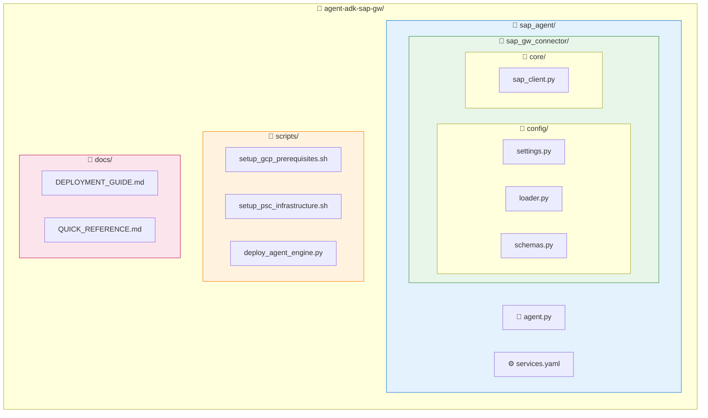

# SAP Agent 빠른 참조 가이드

## 전체 설정 흐름

```bash
# 1. GCP 기본 리소스 설정 (API, 서비스 계정, IAM)
./scripts/setup_gcp_prerequisites.sh

# 2. PSC 네트워크 인프라 설정
./scripts/setup_psc_infrastructure.sh

# 3. Agent 배포
python scripts/deploy_agent_engine.py

# 4. 배포 확인
gcloud ai reasoning-engines list --region=us-central1
```

## GCP API 활성화

```bash
gcloud services enable \
    compute.googleapis.com \
    aiplatform.googleapis.com \
    secretmanager.googleapis.com \
    cloudbuild.googleapis.com \
    storage.googleapis.com \
    iam.googleapis.com \
    dns.googleapis.com
```

## 서비스 계정 생성

```bash
# Agent Engine 서비스 계정
gcloud iam service-accounts create agent-engine-sa \
    --display-name="SAP Agent Engine Service Account"
```

## IAM 역할 부여

```bash
PROJECT_ID="your-project-id"
PROJECT_NUMBER=$(gcloud projects describe $PROJECT_ID --format='value(projectNumber)')
SA_EMAIL="agent-engine-sa@${PROJECT_ID}.iam.gserviceaccount.com"

# Agent Engine SA 역할
gcloud projects add-iam-policy-binding $PROJECT_ID \
    --member="serviceAccount:$SA_EMAIL" \
    --role="roles/aiplatform.user"

gcloud projects add-iam-policy-binding $PROJECT_ID \
    --member="serviceAccount:$SA_EMAIL" \
    --role="roles/secretmanager.secretAccessor"

gcloud projects add-iam-policy-binding $PROJECT_ID \
    --member="serviceAccount:$SA_EMAIL" \
    --role="roles/serviceusage.serviceUsageConsumer"

# GCP 서비스 에이전트 역할
gcloud projects add-iam-policy-binding $PROJECT_ID \
    --member="serviceAccount:service-${PROJECT_NUMBER}@gcp-sa-aiplatform.iam.gserviceaccount.com" \
    --role="roles/compute.networkAdmin"

gcloud projects add-iam-policy-binding $PROJECT_ID \
    --member="serviceAccount:service-${PROJECT_NUMBER}@gcp-sa-aiplatform-re.iam.gserviceaccount.com" \
    --role="roles/serviceusage.serviceUsageConsumer"
```

## 배포 명령어

```bash
# 배포 실행
python scripts/deploy_agent_engine.py

# 배포 확인
gcloud ai reasoning-engines list --region=us-central1
```

## 핵심 설정

| 항목 | 값 |
|------|-----|
| SAP Host (내부) | `10.142.0.5` |
| SAP Port | `44300` |
| Model | `gemini-2.5-pro` |
| Region | `us-central1` |

## 주요 이슈 해결 요약

| 이슈 | 해결 |
|------|------|
| Gateway subprocess 불가 | Direct Python 함수로 전환 |
| serviceUsageConsumer 권한 | 서비스 계정에 역할 부여 |
| Secret Manager import 오류 | Lazy loading 패턴 적용 |
| Event loop 충돌 | `nest_asyncio` 추가 |
| SAP 연결 타임아웃 | 내부 IP로 변경 |

## Secret Manager 업데이트

```bash
echo '{
  "host": "10.142.0.5",
  "port": 44300,
  "client": "100",
  "username": "USERNAME",
  "password": "PASSWORD"
}' | gcloud secrets versions add sap-credentials --data-file=-
```

## PSC 인프라 설정

```bash
# 환경 변수로 커스터마이징 가능
export PROJECT_ID="your-project-id"
export VPC_NAME="your-vpc-network"
export SAP_IP="10.x.x.x"

./scripts/setup_psc_infrastructure.sh
```

## Agent 테스트

```python
from vertexai import agent_engines

agent = agent_engines.get("projects/110191959938/locations/us-central1/reasoningEngines/5675639440161112064")
session = agent.create_session()
response = session.send_message("SAP 서비스 목록 보여줘")
```

## 파일 구조



## 디버깅 팁

```bash
# Agent Engine 로그 확인
gcloud logging read "resource.type=aiplatform.googleapis.com/ReasoningEngine" --limit=50

# Secret 값 확인
gcloud secrets versions access latest --secret=sap-credentials
```
