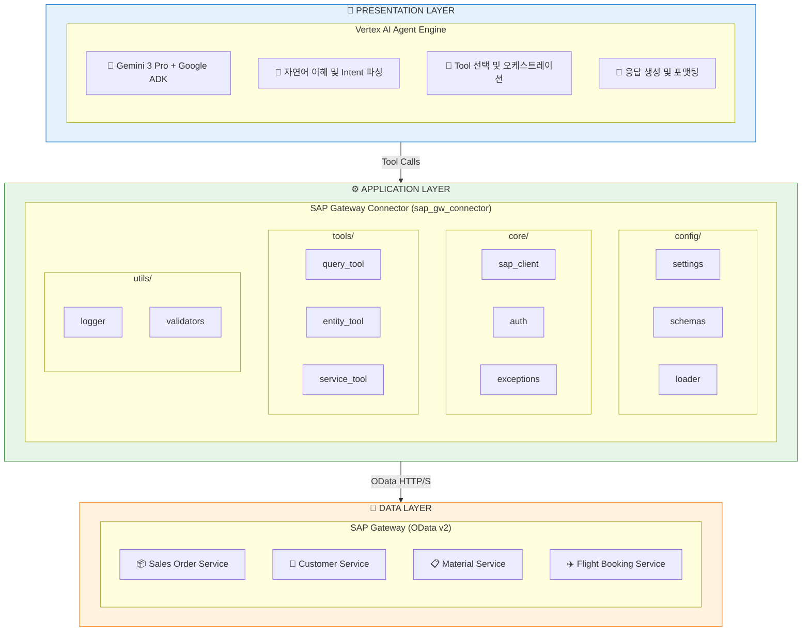
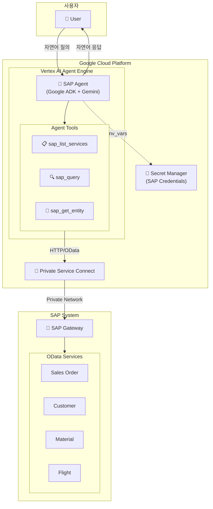
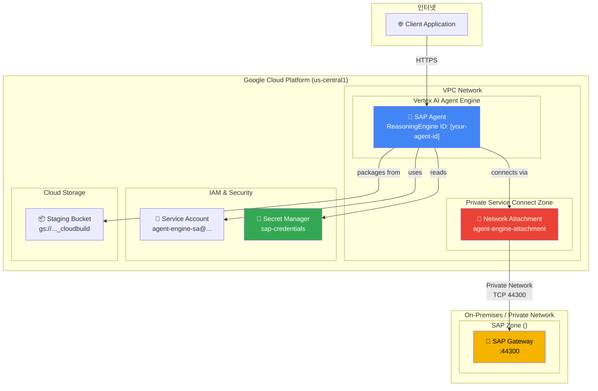

# SAP Agent with Google ADK

SAP Gateway OData 서비스와 통합된 AI Agent로, 자연어를 통해 SAP 데이터를 조회하고 분석할 수 있습니다.

[](https://www.python.org/)
[](https://cloud.google.com/vertex-ai/docs/reasoning-engine/overview)
[](https://cloud.google.com/vertex-ai)

---

## 목차

- [개요](#개요)
- [아키텍처](#아키텍처)
- [프로젝트 구조](#프로젝트-구조)
- [시작하기](#시작하기)
- [사용법](#사용법)
- [알려진 이슈 및 제한사항](#알려진-이슈-및-제한사항)
- [배포](#배포)
- [개발 가이드](#개발-가이드)
- [기여 가이드](#기여-가이드)
- [라이선스](#라이선스)

---

## 개요

### 프로젝트 목적

SAP OData 서비스와 통합된 AI Agent를 Google Cloud의 Vertex AI Agent Engine에 배포하여, 자연어로 SAP 데이터를 조회하고 분석할 수 있는 시스템을 제공합니다.

### 주요 기능

| 기능 | 설명 |
|------|------|
| `sap_list_services` | 사용 가능한 SAP OData 서비스 목록 조회 |
| `sap_query` | SAP 엔티티 세트에 대한 필터링 쿼리 실행 |
| `sap_get_entity` | 특정 키로 단일 엔티티 조회 |

### 기술 스택

| 구성요소 | 기술 |
|---------|------|
| AI Framework | Google ADK (Agent Development Kit) |
| LLM Model | Gemini 3 Pro Preview (`SAP_AGENT_MODEL` 환경변수로 변경 가능) |
| 배포 플랫폼 | Vertex AI Agent Engine |
| SAP 연동 | OData v2 Protocol |
| 인증 관리 | Google Secret Manager |
| 네트워크 | Private Service Connect (PSC) |
| HTTP Client | aiohttp (async) |
| 설정 관리 | Pydantic Settings |

---

## 아키텍처

### 아키텍처 개요

이 프로젝트는 **3-Tier 아키텍처**를 기반으로 설계되었습니다:


```mermaid
flowchart TB
    subgraph PresentationLayer["🎨 PRESENTATION LAYER"]
        subgraph AgentEngine["Vertex AI Agent Engine"]
            Gemini["🤖 Gemini 3 Pro + Google ADK"]
            NLU["📝 자연어 이해 및 Intent 파싱"]
            Orchestration["🔧 Tool 선택 및 오케스트레이션"]
            Response["💬 응답 생성 및 포맷팅"]
        end
    end

    subgraph ApplicationLayer["⚙️ APPLICATION LAYER"]
        subgraph GWConnector["SAP Gateway Connector (sap_gw_connector)"]
            subgraph ConfigMod["config/"]
                Settings["settings"]
                Schemas["schemas"]
                Loader["loader"]
            end
            subgraph CoreMod["core/"]
                SAPClient["sap_client"]
                Auth["auth"]
                Exceptions["exceptions"]
            end
            subgraph ToolsMod["tools/"]
                QueryTool["query_tool"]
                EntityTool["entity_tool"]
                ServiceTool["service_tool"]
            end
            subgraph UtilsMod["utils/"]
                Logger["logger"]
                Validators["validators"]
            end
        end
    end

    subgraph DataLayer["💾 DATA LAYER"]
        subgraph SAPGateway["SAP Gateway (OData v2)"]
            SalesOrder["📦 Sales Order Service"]
            Customer["👥 Customer Service"]
            Material["📋 Material Service"]
            Flight["✈️ Flight Booking Service"]
        end
    end

    PresentationLayer -->|"Tool Calls"| ApplicationLayer
    ApplicationLayer -->|"OData HTTP/S"| DataLayer

    style PresentationLayer fill:#e3f2fd,stroke:#1976d2
    style ApplicationLayer fill:#e8f5e9,stroke:#388e3c
    style DataLayer fill:#fff3e0,stroke:#f57c00
```

### 핵심 설계 원칙

| 원칙 | 설명 |
|------|------|
| **Separation of Concerns** | Agent, Connector, SAP 각 계층의 책임 분리 |
| **Async-First** | aiohttp 기반 비동기 HTTP 클라이언트로 성능 최적화 |
| **Configuration-Driven** | YAML 기반 서비스 설정으로 코드 변경 없이 확장 가능 |
| **Security Infrastructure** | CSRF 토큰, Secret Manager, PSC 통합이 구현되어 있으나, `verify_ssl` 기본값이 `False`로 설정되어 있어 프로덕션 환경에서는 강화가 필요합니다 |
| **Lazy Loading** | 런타임 권한 이슈 방지를 위한 지연 로딩 패턴 |

---

### 시스템 아키텍처


```mermaid
flowchart TB
    subgraph User["사용자"]
        U["👤 User"]
    end

    subgraph GCP["Google Cloud Platform"]
        subgraph AE["Vertex AI Agent Engine"]
            Agent["🤖 SAP Agent<br/>(Google ADK + Gemini)"]
            subgraph Tools["Agent Tools"]
                ListSvc["📋 sap_list_services"]
                Query["🔍 sap_query"]
                GetEntity["📄 sap_get_entity"]
            end
        end

        SM["🔐 Secret Manager<br/>(SAP Credentials)"]
        PSC["🔗 Private Service Connect"]
    end

    subgraph SAP["SAP System"]
        GW["🏢 SAP Gateway"]
        subgraph OData["OData Services"]
            SO["Sales Order"]
            CU["Customer"]
            MA["Material"]
            FL["Flight"]
        end
    end

    U -->|"자연어 질의"| Agent
    Agent --> Tools
    Agent -.->|"env_vars"| SM
    Tools -->|"HTTP/OData"| PSC
    PSC -->|"Private Network"| GW
    GW --> OData
    Agent -->|"자연어 응답"| U
```

---

### 배포 아키텍처


```mermaid
flowchart TB
    subgraph Internet["인터넷"]
        Client["🌐 Client Application"]
    end

    subgraph GCP["Google Cloud Platform (us-central1)"]
        subgraph VPC["VPC Network"]
            subgraph AgentEngine["Vertex AI Agent Engine"]
                AE["🤖 SAP Agent<br/>ReasoningEngine ID: [your-agent-id]"]
            end

            subgraph PSCZone["Private Service Connect Zone"]
                NA["🔗 Network Attachment<br/>agent-engine-attachment"]
            end
        end

        subgraph IAM["IAM & Security"]
            SA["👤 Service Account<br/>agent-engine-sa@..."]
            SM["🔐 Secret Manager<br/>sap-credentials"]
        end

        subgraph Storage["Cloud Storage"]
            SB["📦 Staging Bucket<br/>gs://..._cloudbuild"]
        end
    end

    subgraph OnPrem["On-Premises / Private Network"]
        subgraph SAPZone["SAP Zone (<your-network-cidr>)"]
            SAPGW["🏢 SAP Gateway<br/><your-sap-internal-ip>:44300"]
        end
    end

    Client -->|"HTTPS"| AE
    AE -->|"reads"| SM
    AE -->|"uses"| SA
    AE -->|"packages from"| SB
    AE -->|"connects via"| NA
    NA -->|"Private Network<br/>TCP 44300"| SAPGW

    style AE fill:#4285f4,color:#fff
    style SAPGW fill:#f4b400,color:#000
    style SM fill:#34a853,color:#fff
    style NA fill:#ea4335,color:#fff
```

---

### 보안 구성 요소

| 구성 요소 | 설명 | 구현 위치 |
|----------|------|----------|
| **Secret Manager** | SAP 자격증명 암호화 저장 | `agent.py:load_secrets_from_manager()` |
| **CSRF Token** | SAP 요청 무결성 검증 | `core/auth.py:SAPAuthenticator` |
| **Private Service Connect** | VPC 내부 네트워크 통신 | 배포 설정 `psc_interface_config` |
| **Service Account** | 최소 권한 IAM 역할 | `agent-engine-sa@...` |
| **Lazy Loading** | Import 시점 권한 이슈 방지 | `agent.py:_get_secret_manager()` |

---

## 시작하기

### 요구사항

- Python 3.11 이상
- Google Cloud SDK (gcloud CLI)
- SAP Gateway 접근 권한
- GCP 프로젝트 (Owner 또는 Editor 권한)

### 설치

```bash
# 저장소 클론
git clone <repository-url>
cd agent-adk-sap-gw

# 가상환경 생성 및 활성화
python -m venv .venv
source .venv/bin/activate  # Windows: .venv\Scripts\activate

# 의존성 설치
pip install -e ".[dev]"
```

---

## GCP 사전 설정

### 자동 설정 (권장)

스크립트를 사용하여 모든 GCP 리소스를 자동으로 설정합니다:

```bash
# 1. GCP 기본 리소스 설정 (API, 서비스 계정, IAM)
./scripts/setup_gcp_prerequisites.sh

# 2. PSC 네트워크 인프라 설정
./scripts/setup_psc_infrastructure.sh

# 3. Agent 배포
python scripts/deploy_agent_engine.py
```

### 필수 API 목록

| API | 용도 |
|-----|------|
| `compute.googleapis.com` | VPC, PSC 네트워크 관리 |
| `aiplatform.googleapis.com` | Vertex AI Agent Engine |
| `secretmanager.googleapis.com` | SAP 자격증명 저장 |
| `cloudbuild.googleapis.com` | Agent 패키징 및 배포 |
| `storage.googleapis.com` | Staging 버킷 |
| `iam.googleapis.com` | IAM 관리 |
| `dns.googleapis.com` | PSC DNS 설정 |
| `servicenetworking.googleapis.com` | 서비스 네트워킹 |

### 서비스 계정 및 IAM 역할

| 서비스 계정 | 역할 | 용도 |
|------------|------|------|
| `agent-engine-sa` | `roles/aiplatform.user` | Vertex AI 사용 |
| `agent-engine-sa` | `roles/secretmanager.secretAccessor` | Secret Manager 접근 |
| `agent-engine-sa` | `roles/storage.objectViewer` | Staging 버킷 읽기 |
| `agent-engine-sa` | `roles/logging.logWriter` | Cloud Logging 쓰기 |
| `agent-engine-sa` | `roles/serviceusage.serviceUsageConsumer` | 프로젝트 서비스 사용 |
| `gcp-sa-aiplatform` | `roles/compute.networkAdmin` | PSC 네트워크 관리 |
| `gcp-sa-aiplatform` | `roles/dns.peer` | PSC DNS 피어링 |

---

## 환경 설정

### 로컬 개발 환경

SAP 자격증명용 `.env` 파일 생성:

```bash
# sap_agent/.env
SAP_HOST=<your-sap-host>
SAP_PORT=<your-sap-port>
SAP_CLIENT=<your-sap-client>
SAP_USERNAME=<your-sap-username>
SAP_PASSWORD=<your-sap-password>
```

### Secret Manager 설정 (배포용)

```bash
# Secret 생성
gcloud secrets create sap-credentials --replication-policy="automatic"

# Secret 값 설정
echo '{
  "host": "<your-sap-internal-ip>",
  "port": 44300,
  "client": "100",
  "username": "<your-sap-username>",
  "password": "<your-sap-password>"
}' | gcloud secrets versions add sap-credentials --data-file=-
```

---

## 알려진 이슈 및 제한사항

종합적인 코드 리뷰를 통해 확인된 항목입니다. 에이전트의 기본 기능에는 영향을 주지 않으나, 프로덕션 배포 전에 해결해야 할 사항들입니다.

| 영역 | 이슈 | 권장 조치 |
|------|------|----------|
| **SSL 검증** | `SAPConnectionConfig`의 `verify_ssl` 기본값이 `False`로 설정되어 인증서 검증이 비활성화됨 | 프로덕션 배포 시 `verify_ssl=True`로 설정 |
| **디버그 로깅** | `agent.py`의 `print()` 문이 Secret Manager 키 이름, SAP 호스트 IP, 프로젝트 ID를 Cloud Logging에 출력 | 구조화된 로깅으로 교체하고 민감 정보를 로그에서 제거 |
| **OData 필터 인젝션** | SAP OData 쿼리의 `$filter` 파라미터가 검증 없이 전달됨; `utils/validators.py`에 검증 함수가 존재하나 호출되지 않음 | `validators.py`의 입력 검증을 쿼리 파이프라인에 통합 |
| **클라이언트 인스턴스화** | 매 Tool 호출마다 새로운 `SAPClient`, `aiohttp` 세션, SSL 컨텍스트를 생성 (호출당 ~200-500ms 오버헤드); 모듈 레벨 싱글턴 패턴이 존재하나 미사용 | 기존 싱글턴 패턴 활성화 또는 커넥션 풀링 구현 |
| **미사용 모듈** | `tools/` 클래스 (`SAPTool`, `ToolRegistry`), `protocol/`, `transports/`, `utils/logger.py`, `utils/validators.py`가 Agent Engine 배포에서 미사용 | 데드 코드 제거 또는 클래스 기반 Tool 아키텍처 통합 검토 |
| **테스트 커버리지** | 자동화된 테스트가 없음 (0% 커버리지); 테스트 파일 및 인프라 부재 | 테스트 인프라 구축 및 단위/통합/E2E 테스트 구현 |
| **의존성 명세** | 코드에서 사용하는 일부 런타임 의존성 (`aiohttp`, `pydantic-settings` 등)이 `pyproject.toml`에 선언되지 않음; 배포 스크립트가 별도의 requirements 목록을 관리 | `pyproject.toml` 의존성과 배포 스크립트 requirements 동기화 |

---

## 배포

### Vertex AI Agent Engine 배포

```bash
# 배포 스크립트 실행
python scripts/deploy_agent_engine.py
```

### 배포 설정

| 항목 | 값 |
|------|-----|
| Region | us-central1 |
| Model | gemini-3-pro-preview (`SAP_AGENT_MODEL` 환경변수로 변경 가능) |
| Network | PSC (Private Service Connect) |
| Service Account | agent-engine-sa@PROJECT.iam.gserviceaccount.com |

### 배포 확인

```bash
# Agent Engine 목록 확인
gcloud ai reasoning-engines list --region=us-central1
```

---

## 기여 가이드

이 프로젝트는 아키텍처, 보안, 성능, 코드 품질, DevOps, 테스트 커버리지에 대한 종합적인 코드 리뷰를 완료했습니다. 기여를 환영하는 주요 영역:

- **보안 강화**: SSL 검증 기본 활성화, 입력 검증 통합, 디버그 `print()` 문을 구조화된 로깅으로 교체
- **성능 최적화**: SAPClient 싱글턴 패턴 구현, SSL 컨텍스트 및 세션 생성 통합
- **테스트 인프라**: pytest 설정, config/auth/validators 단위 테스트, SAPClient 통합 테스트, 에이전트 워크플로우 E2E 테스트 작성
- **의존성 관리**: `pyproject.toml`과 배포 스크립트 requirements 동기화 및 CI/CD 파이프라인 추가
- **코드 정리**: 미사용 모듈 (`tools/`, `protocol/`, `transports/`) 제거 또는 통합, 코드 중복 제거

전체 리뷰 결과는 위의 [알려진 이슈 및 제한사항](#알려진-이슈-및-제한사항) 섹션을 참조하세요.

---

## 트러블슈팅

### 일반적인 이슈

| 이슈 | 해결 방법 |
|------|----------|
| Gateway subprocess 불가 | Direct Python 함수로 전환됨 |
| serviceUsageConsumer 권한 오류 | 서비스 계정에 역할 부여 |
| Secret Manager import 오류 | Lazy loading 패턴 적용됨 |
| Event loop 충돌 | `nest_asyncio` 패키지 사용 |
| SAP 연결 타임아웃 | 내부 IP 확인 (PSC 사용 시) |

---

## 라이선스

MIT License

---

## 참고 문서

- [Google ADK Documentation](https://cloud.google.com/vertex-ai/docs/reasoning-engine/overview)
- [Vertex AI Agent Engine](https://cloud.google.com/vertex-ai/docs/reasoning-engine/deploy)
- [SAP OData Services](https://help.sap.com/docs/SAP_NETWEAVER_AS_ABAP_751_IP)
