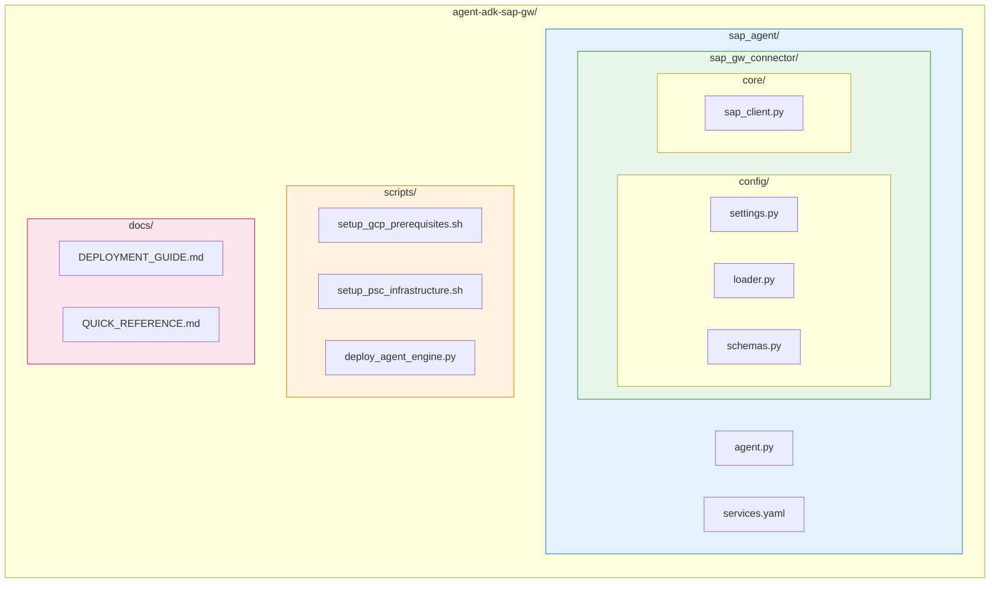

# SAP Agent Quick Reference Guide

## Complete Setup Flow

```bash
# 1. GCP base resource setup (API, service account, IAM)
./scripts/setup_gcp_prerequisites.sh

# 2. PSC network infrastructure setup
./scripts/setup_psc_infrastructure.sh

# 3. Agent deployment
python scripts/deploy_agent_engine.py

# 4. Verify deployment
gcloud ai reasoning-engines list --region=us-central1
```

## GCP API Enablement

```bash
gcloud services enable \
    compute.googleapis.com \
    aiplatform.googleapis.com \
    secretmanager.googleapis.com \
    cloudbuild.googleapis.com \
    storage.googleapis.com \
    iam.googleapis.com \
    dns.googleapis.com
```

## Service Account Creation

```bash
# Agent Engine service account
gcloud iam service-accounts create agent-engine-sa \
    --display-name="SAP Agent Engine Service Account"
```

## IAM Role Assignment

```bash
PROJECT_ID="[your-project-id]"
PROJECT_NUMBER=$(gcloud projects describe $PROJECT_ID --format='value(projectNumber)')
SA_EMAIL="agent-engine-sa@${PROJECT_ID}.iam.gserviceaccount.com"

# Agent Engine SA roles
gcloud projects add-iam-policy-binding $PROJECT_ID \
    --member="serviceAccount:$SA_EMAIL" \
    --role="roles/aiplatform.user"

gcloud projects add-iam-policy-binding $PROJECT_ID \
    --member="serviceAccount:$SA_EMAIL" \
    --role="roles/secretmanager.secretAccessor"

gcloud projects add-iam-policy-binding $PROJECT_ID \
    --member="serviceAccount:$SA_EMAIL" \
    --role="roles/serviceusage.serviceUsageConsumer"

# GCP service agent roles
gcloud projects add-iam-policy-binding $PROJECT_ID \
    --member="serviceAccount:service-${PROJECT_NUMBER}@gcp-sa-aiplatform.iam.gserviceaccount.com" \
    --role="roles/compute.networkAdmin"

gcloud projects add-iam-policy-binding $PROJECT_ID \
    --member="serviceAccount:service-${PROJECT_NUMBER}@gcp-sa-aiplatform-re.iam.gserviceaccount.com" \
    --role="roles/serviceusage.serviceUsageConsumer"
```

## Deployment Commands

```bash
# Run deployment
python scripts/deploy_agent_engine.py

# Verify deployment
gcloud ai reasoning-engines list --region=us-central1
```

## Key Configuration

| Item | Value |
|------|-------|
| SAP Host (Internal) | `10.142.0.5` |
| SAP Port | `44300` |
| Model | `gemini-2.5-pro` |
| Region | `us-central1` |

## Common Issue Resolution Summary

| Issue | Solution |
|-------|----------|
| Gateway subprocess not available | Switched to Direct Python functions |
| serviceUsageConsumer permission | Grant role to service account |
| Secret Manager import error | Lazy loading pattern applied |
| Event loop conflict | Added `nest_asyncio` |
| SAP connection timeout | Changed to internal IP |

## Secret Manager Update

```bash
echo '{
  "host": "10.142.0.5",
  "port": 44300,
  "client": "100",
  "username": "USERNAME",
  "password": "PASSWORD"
}' | gcloud secrets versions add sap-credentials --data-file=-
```

## PSC Infrastructure Setup

```bash
# Customizable via environment variables
export PROJECT_ID="[your-project-id]"
export VPC_NAME="your-vpc-network"
export SAP_IP="10.x.x.x"

./scripts/setup_psc_infrastructure.sh
```

## Agent Testing

```python
from vertexai import agent_engines

agent = agent_engines.get("projects/[your-project-number]/locations/us-central1/reasoningEngines/[your-agent-id]")
session = agent.create_session()
response = session.send_message("Show me the SAP service list")
```

## File Structure



## Debugging Tips

```bash
# Check Agent Engine logs
gcloud logging read "resource.type=aiplatform.googleapis.com/ReasoningEngine" --limit=50

# Verify secret value
gcloud secrets versions access latest --secret=sap-credentials
```

---

## Documentation

- [Korean Documentation (한국어 문서)](KR/QUICK_REFERENCE.md)
